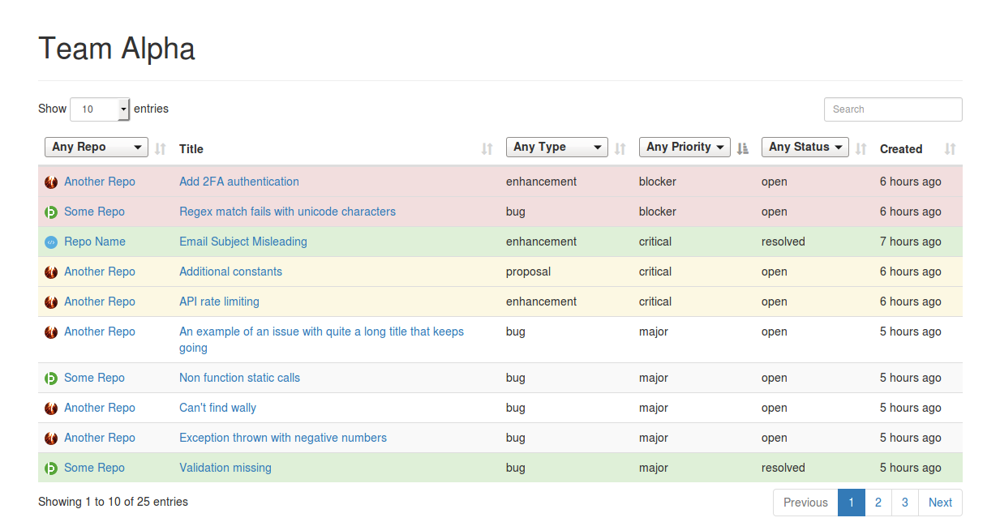

# BitBucket Team Issue Management

A tool that allows you to see, sort, filter and search all issues from all repositories in a BitBucket team.

## Screenshot



## Setup

#### 1: Get the code!

```
git clone git@github.com:moebrowne/BitBucket-Team-Issue-Manger.git

cd BitBucket-Team-Issue-Manger

composer install
yarn
# or
npm install
```
 
#### 2: Setup an OAuth consumer

On the BitBucket team management page (`https://bitbucket.org/account/user/<TEAM_ID>/api`) add an OAuth Consumer. You only need to fill in the name (this can be whatever you want) and grant read access to repositories and issues. 

Next copy the example `auth-sample.json` to `auth.json` and populate it with the Key and Secret from the new OAuth consumer.

#### 3: Run the JSONifier

Next we need to get all the issues from BitBucket, this is easily done by calling:

```
php -f teamIssuesToJSON.php TEAM_ID
```

You should now see a `TEAM_ID.json` in the project root, this is all your issue data.

## Viewing The Data

You should now be able to see your data if you run up a little test server:
 
```
php -S localhost:9090
```

And browse to `http://localhost:9090/index.php?teamName=TEAM_ID`
